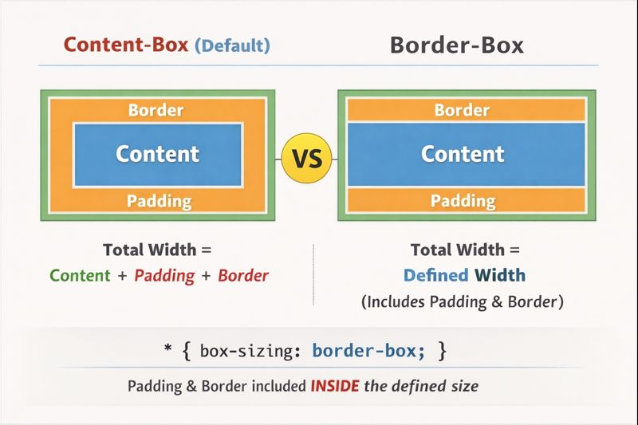

# ✏️ Topic: Introduction to CSS

## 🌟 Cues / Questions  

- What are the three ways to add CSS to HTML?  
- What are the main types of CSS selectors?  
- How does specificity affect which styles are applied?  
- What's the difference between content-box and border-box?

---

## 📝 Notes  

### 🎨 Adding CSS to HTML

There are **three ways** to add CSS to an HTML website:

1. **Inline CSS**  
   - Styles a single element directly within its HTML tag.  
   - Example: `<p style="color: red;">Hello World</p>`  

2. **Internal CSS**  
   - Placed inside a `<style>` tag, usually in the `<head>` section.  
   - Example:
  
    ```html
    <style>
      p { color: blue; }
    </style>
    ```

3. **External CSS** *(most common & scalable)*  
   - Written in a separate `.css` file and linked via `<link>` in the `<head>`.  
   - Example:

    ```html
    <link rel="stylesheet" href="style.css">
    ```

---

### 🧩 CSS Selectors

- **Element Selector**  
  - Targets all tags of a type.  
  - Example: `h2 { color: green; }` → all `<h2>` elements  

- **Class Selector**  
  - Targets elements with a specific class.  
  - Example: `.red-text { color: red; }` → elements with `class="red-text"`  

- **ID Selector**  
  - Targets a unique element by ID.  
  - Example: `#main { font-size: 20px; }` → element with `id="main"`  

- **Attribute Selector**  
  - Targets elements with a specific attribute or attribute value.  
  - Example: `p[draggable="false"] { cursor: default; }`  

- **Universal Selector**  
  - Targets **all elements** on the page.  
  - Example: `* { box-sizing: border-box; }`  

---

### 📦 Box Model & Box-Sizing

Every HTML element is rendered as a rectangular box with four areas: content, padding, border, and margin.


*Comparison between Content-Box and Border-Box*

**Two box-sizing models:**

1. **Content-Box (Default)**
   - `width` and `height` apply **only to the content**
   - Total Width = Content + Padding + Border
   - Example: If you set `width: 200px`, padding of `20px`, and border of `5px`, the actual element width becomes `250px`

2. **Border-Box** *(recommended for layouts)*
   - `width` and `height` include **padding and border**
   - Total Width = Defined Width (padding & border included inside)
   - Example: If you set `width: 200px`, the element stays `200px` wide regardless of padding or border

**Best Practice:**

```css
* {
  box-sizing: border-box;
}
```

This ensures more predictable sizing when working with layouts, as the defined width remains constant even when adding padding or borders.

---

### ⚖️ Specificity

- **Specificity**  
  - Determines which style takes precedence when multiple rules apply.  
  - Example: `#main` overrides `.red-text` if both apply to the same element  

- **How specificity is calculated**

  Specificity is calculated based on four categories, often written as (a, b, c, d):

  | Level | What counts | Example |
  | ----- | ----------- | ------- |
  | a | Inline styles | `<div style="color:red;">` → a=1 |
  | b | IDs | `#header` → b=1 |
  | c | Classes, attributes, pseudo-classes | `.menu`, `[type="text"]`, `:hover` → c=1 each |
  | d | Elements and pseudo-elements | `div`, `p`, `::before` → d=1 each |

  Specificity is compared left to right, from a down to d.

- **Examples**

  - Element selector: `p { color: blue; }` → (0,0,0,1)
  - Class selector: `.highlight { color: red; }` → (0,0,1,0)
  - ID selector: `#main { color: green; }` → (0,1,0,0)
  - Inline style: `<p style="color: yellow;">` → (1,0,0,0)

**Result:** Inline > ID > Class > Element

- **Combinations**

  - `div p {}` → (0,0,0,2) (two element selectors)
  - `.menu li a:hover {}` → (0,0,3,2) (3 class/pseudo-class + 2 elements)
  - `#content .menu li a {}` → (0,1,2,2) (1 ID + 2 classes + 2 elements)

  The browser compares from left to right, so higher numbers at the left "win" over anything lower on the right.

- **Important tip**

  - `!important` overrides specificity, but it's best used sparingly.
  - Inline styles are very strong but still overridden by `!important`.

---

## 🔑 Summary  

CSS is the **language for styling HTML**, allowing you to control **colors, fonts, layout, and spacing**.  
You can add styles **inline, internally, or externally**, with external stylesheets being the most maintainable.  
CSS selectors let you target elements efficiently, and **specificity** decides which styles are applied when rules conflict.  
Understanding the **box model** and using `box-sizing: border-box` helps create more predictable and maintainable layouts.

---
