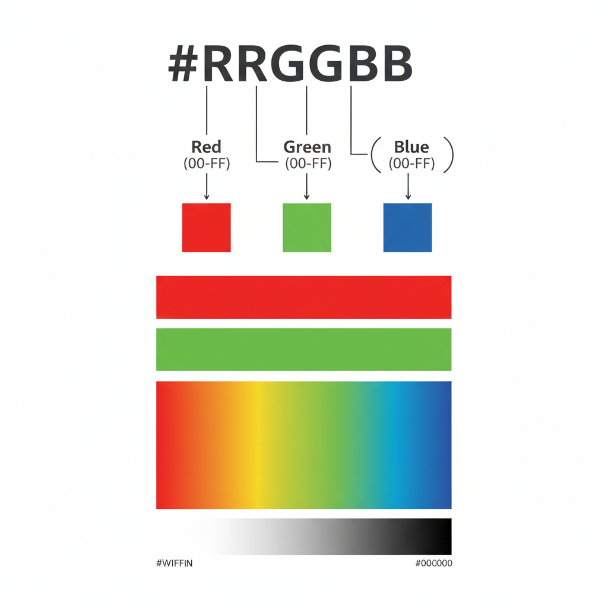

# ✏️ CSS Properties Study Notes

## 📚 Table of Contents

- [CSS Colors](#css-colors)
- [CSS Font Properties](#css-font-properties)
- [Inspecting CSS with Chrome DevTools](#inspecting-css)
- [CSS Box Model](#css-box-model)

---

## 🎨 CSS Colors {#css-colors}

> **💡 Key Concept:** CSS colors style both **text** and **backgrounds**.

### Basic Color Properties

```css
h1 { color: red; }                           /* Text color */
body { background-color: antiquewhite; }     /* Background color */
```

### Color Formats

| Format    | Example                         | Use Case                 |
| --------- | ------------------------------- | ------------------------ |
| **Named** | `red`, `blue`, `cornflowerblue` | Quick prototyping        |
| **Hex**   | `#5d3891`, `#FF0000`            | Production (most common) |
| **RGB**   | `rgb(255, 0, 0)`                | Dynamic colors           |
| **RGBA**  | `rgba(255, 0, 0, 0.5)`          | With transparency        |
| **HSL**   | `hsl(0, 100%, 50%)`             | Color adjustments        |

#### Hex Format Explained

<p align="center">
  
</p>

### 🎨 Color Tools

- **[Color Hunt](https://colorhunt.co)** - Ready-made palettes
- **[Coolors.co](https://coolors.co)** - Generate schemes
- **[MDN Named Colors](https://developer.mozilla.org/en-US/docs/Web/CSS/named-color)** - Full list

### 🧾 Quick Summary

```css
/* Common patterns */
color: red;                          /* Named */
color: #5d3891;                      /* Hex */
background-color: rgba(0, 0, 0, 0.5); /* Transparent */
```

---

## 🔤 CSS Font Properties {#css-font-properties}

### 📏 Font Size (`font-size`)

| Unit   | Behavior          | Example   | Recommended?       |
|--------|-------------------|-----------|:-----------------: |
| `px`   | Fixed size        | `16px`    | ⚠️                 |
| `em`   | Relative to parent| `1.5em`   | ⚠️ (compounds)     |
| `rem`  | Relative to root  | `1.5rem`  | ✅ **YES**         |

#### Why rem is Best

```css
html { font-size: 16px; }     /* Root size */

h1 { font-size: 2rem; }       /* 32px - always relative to root */
p { font-size: 1rem; }        /* 16px - predictable */
small { font-size: 0.875rem; } /* 14px */
```

**Benefits:** Predictable, accessible, no compounding issues.

### ⚖️ Font Weight (`font-weight`)

| Value      | Name                  | Use Case           |
|:----------:|---------------------  |------------------  |
| 100-300    | Thin/Light            | Large display text |
| **400**    | **Normal**            | **Body text**      |
| 500-600    | Medium/Semi Bold      | Emphasis           |
| **700**    | **Bold**              | **Headings**       |
| 800-900    | Extra Bold/Black      | Maximum impact     |

```css
p { font-weight: 400; }        /* Normal */
strong { font-weight: 700; }   /* Bold */
h1 { font-weight: 900; }       /* Heavy */
```

### 🖋️ Font Family (`font-family`)

Always include a **fallback chain**:

```css
body {
  font-family: "Helvetica Neue", Helvetica, Arial, sans-serif;
}
```

#### Generic Families

| Family       | Style                   | Examples                 |
|------------- |-------------------------|--------------------------|
| `serif`      | Formal, decorative edges| Times New Roman, Georgia |
| `sans-serif` | Modern, clean           | Arial, Helvetica         |
| `monospace`  | Fixed-width (code)      | Courier, Consolas        |

#### Using Google Fonts

```html
<!-- 1. Add to HTML <head> -->
<link href="https://fonts.googleapis.com/css2?family=Roboto:wght@400;700&display=swap" rel="stylesheet">
```

```css
/* 2. Use in CSS */
body { font-family: 'Roboto', sans-serif; }
```

**📖 [Google Fonts](https://fonts.google.com)**

### 📐 Text Alignment (`text-align`)

```css
p { text-align: left; }      /* Default */
h1 { text-align: center; }   /* Centered */
p { text-align: right; }     /* Right-aligned */
p { text-align: justify; }   /* Full-width (use cautiously) */
```

### 🧾 Quick Summary

```css
/* Recommended font setup */
html { font-size: 16px; }

body {
  font-family: Arial, sans-serif;
  font-size: 1rem;
  font-weight: 400;
  text-align: left;
}

h1 {
  font-size: 2rem;
  font-weight: 700;
  text-align: center;
}
```

---

## 🔍 Inspecting CSS with Chrome DevTools {#inspecting-css}

### 🧰 Opening DevTools

| Method                | Shortcut               |
|---------------------  |----------------------- |
| **Keyboard (Mac)**    | `Cmd + Option + I`     |
| **Keyboard (Windows)**| `Ctrl + Shift + I`     |
| **Function Key**      | `F12`                  |
| **Right-Click**       | Right-click → Inspect  |

### 🧱 Key Panels

#### Elements Tab

- Shows HTML structure
- Click elements to inspect

#### Styles Panel

- All CSS rules applied
- Edit/toggle properties live
- Crossed-out = overridden

#### Computed Tab

- Final applied styles
- No crossed-out rules
- Shows box model diagram

### ✏️ Live Editing

**You can:**

- ✔️ Add/edit properties
- ✔️ Toggle checkboxes to enable/disable
- ✔️ Change colors with color picker
- ✔️ See changes instantly

**⚠️ Important:** Changes are **temporary** (lost on refresh)

### 🛠️ Useful Features

Box Model in DevTools:

- View in Computed tab or Styles panel
- Color-coded: 🟦 Content | 🟩 Padding | 🟨 Border | 🟧 Margin
- Hover over diagram sections to highlight on page
- Click values to edit dimensions live

**Element States:**

- Click `:hov` to simulate `:hover`, `:active`, `:focus`

**CSS Overview:**

- DevTools → ⋮ → More Tools → CSS Overview
- Shows all colors, fonts used on page

### 🧪 Practice

- **[Just Add CSS](https://appbrewery.github.io/just-add-css/)** - DevTools practice
- **[CSS Inspection Exercise](https://appbrewery.github.io/css-inspection)** - Find values

### 🧾 Quick Summary

1. Open DevTools (`F12` or Right-click → Inspect)
2. Use Styles panel to edit CSS live
3. Check Computed tab for final values
4. Remember: Changes are temporary!

---

## 📦 CSS Box Model {#css-box-model}

> **💡 Key Concept:** Every element is a box with content, padding, border, and margin.

### 🧱 The Box Model

<p align="center">
  
  <br>
  <em>Box Model Visualization</em>
</p>

### 📏 Width & Height

```css
div {
  width: 200px;
  height: 100px;
}
```

### 🔲 Border

**Syntax:** `border: [width] [style] [color];`

```css
div { border: 30px solid black; }
```

**Common Styles:** `solid`, `dashed`, `dotted`, `double`, `none`

**Individual sides:**

```css
border-top: 2px solid red;
border-right: 3px dashed blue;
```

### 📏 Padding (Inside)

Space **inside** the border.

```css
div { padding: 20px; }      /* All sides */
```

### 🖼️ Margin (Outside)

Space **outside** the border.

```css
div { margin: 10px; }       /* All sides */
div { margin: 0 auto; }     /* Center horizontally */
```

### 🎯 Shorthand Pattern (Border, Padding, Margin)

```css
/* 1 value - all sides */
padding: 20px;

/* 2 values - vertical | horizontal */
padding: 10px 20px;

/* 3 values - top | horizontal | bottom */
padding: 10px 20px 15px;

/* 4 values - top | right | bottom | left (clockwise ↻) */
padding: 10px 20px 15px 25px;
```

**🧠 Memory Tip:** Clockwise from top (12 o'clock)

### 🎨 Padding vs Margin

| Feature       | Padding                | Margin                     |
|---------------|--------------------    |--------------------------- |
| **Location**  | Inside border          | Outside border             |
| **Background**| Visible                | Transparent                |
| **Use for**   | Spacing content inside | Spacing between elements   |

### 📦 Box Sizing

<p align="center">
  
  <br>
  <em>Content Box vs Border Box</em>
</p>

**Default (`content-box`):**

```css
div {
  width: 200px;
  padding: 20px;
  border: 5px solid;
  /* Total width = 250px */
}
```

**Better (`border-box`):**

```css
* { box-sizing: border-box; }

div {
  width: 200px;
  padding: 20px;
  border: 5px solid;
  /* Total width = 200px (content shrinks) */
}
```

**✅ Recommended:** Always use `border-box`

### 📦 Grouping with Divs

```html
<div class="card">
  <h2>Title</h2>
  <p>Content</p>
</div>
```

```css
.card {
  width: 300px;
  padding: 20px;
  border: 1px solid #ccc;
  margin: 10px;
}
```

### 🧪 Practice

**[Box Model Demo](https://appbrewery.github.io/box-model/)** - Inspect and experiment

### 🐞 Debugging Tool

**Pesticide Chrome Extension** - Outlines all boxes to visualize layout

### 🧾 Quick Summary

```css
/* Complete box example */
.box {
  width: 200px;           /* Content width */
  height: 100px;          /* Content height */
  padding: 20px;          /* Inside space */
  border: 2px solid #000; /* Boundary */
  margin: 10px;           /* Outside space */
}

/* Always add this */
* { box-sizing: border-box; }
```

---

## 🔗 Quick Resources

| Resource         | Link                                                                             |
|----------------- |----------------------------------------------------------------------------------|
| MDN Named Colors | [MDN Named Colors](https://developer.mozilla.org/en-US/docs/Web/CSS/named-color) |
| Color Hunt       | [colorhunt.co](https://colorhunt.co)                                             |
| Google Fonts     | [fonts.google.com](https://fonts.google.com)                                     |
| Box Model Demo   | [Interactive Box Model Demo](https://appbrewery.github.io/box-model/)            |

---
