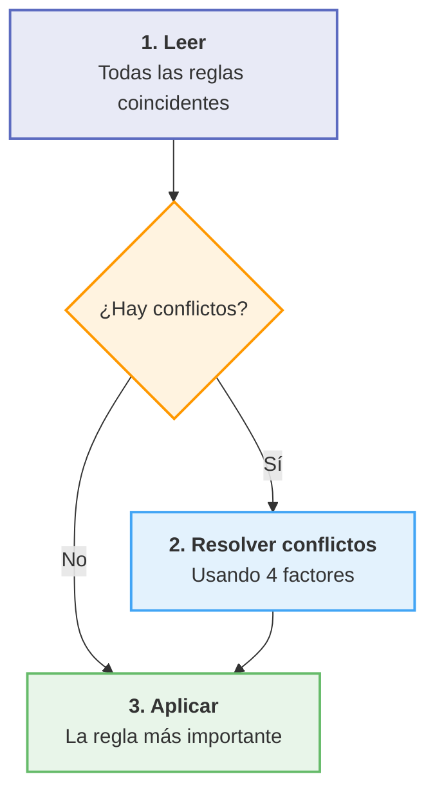
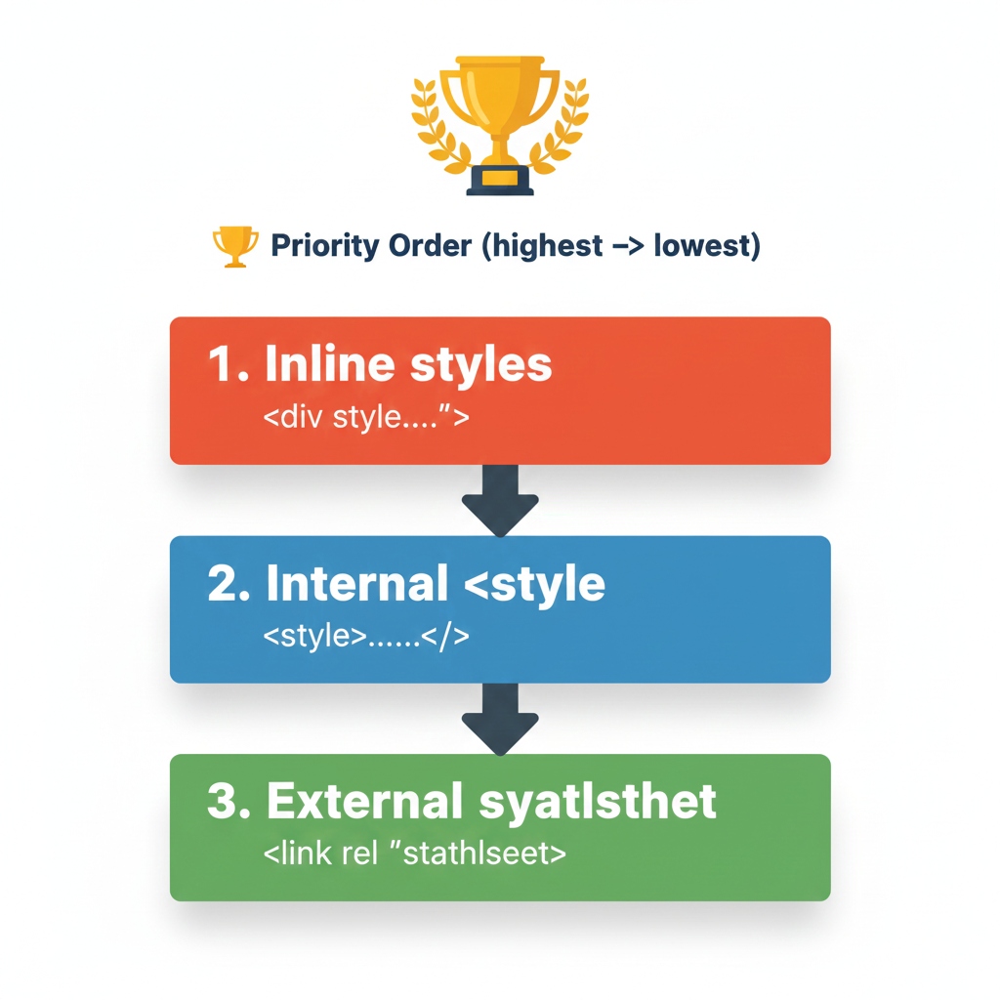
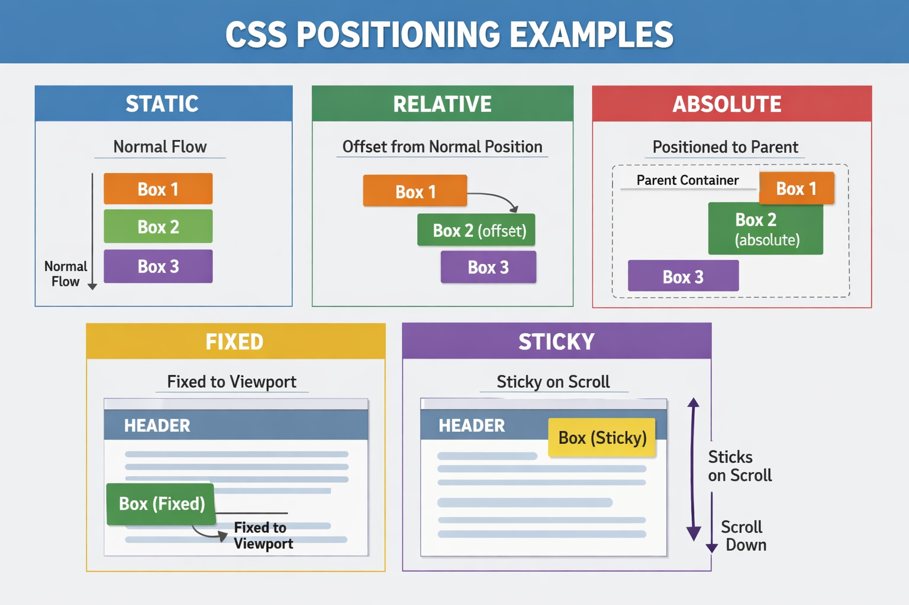

# ✏️ Intermediate CSS Study Notes

## 📚 Table of Contents

- [🎨 CSS Cascade: Specificity & Inheritance](#css-cascade)
- [🧩 Combining CSS Selectors](#combining-selectors)
- [📐 CSS Positioning](#css-positioning)

## <a name="css-cascade"></a>🎨 CSS Cascade: Specificity & Inheritance

### 🌊 What is the CSS Cascade?

> **💡 Key Concept:** The cascade determines which styles win when multiple rules target the same element.

**The browser process:**



Think of styles "cascading" down like a waterfall until the final value is chosen.

### ⚔️ When Do Conflicts Happen?

**Conflicts occur when:**

- ❌ Multiple rules target the same element
- ❌ The same CSS property is defined more than once

#### Example Conflict

```css
/* External CSS */
li { color: green; }
```

```html
<!-- Inline style -->
<li style="color: red;">Item</li>
```

**➡️ Result:** `red` wins (inline style has higher priority)

### 🧩 The 4 Factors That Decide Priority

#### 1️⃣ Position (Order in the File)

> If two rules have the **same specificity**, the rule written **last** wins.

```css
h1 { color: green; }
h1 { color: blue; }  /* ✅ Winner */
```

#### 2️⃣ Specificity (How Targeted the Selector Is)

| Priority | Selector Type | Specificity Value | Example |
| -------- | ------------ | :-------: | --------- |
| 🥇 Highest | Inline style | **1000** | `style="color: red"` |
| 🥈 High | ID selector | **100** | `#title` |
| 🥉 Medium | Class / Attribute / Pseudo-class | **10** | `.title`, `[type="text"]`, `:hover` |
| 4️⃣ Low | Element / Pseudo-element | **1** | `h1`, `::before` |

##### Calculating Specificity

```css
/* Example 1 */
#nav .menu li
/* = 100 + 10 + 1 = 111 */

/* Example 2 */
.header .nav-item:hover
/* = 10 + 10 + 10 = 30 */

/* Example 3 */
#title
/* = 100 */
```

**📊 Comparison:**

```css
#title { color: green; }       /* ✅ Wins (100) */
.title { color: blue; }        /* 10 */
h1 { color: red; }             /* 1 */
```

#### 3️⃣ Type (Where the CSS Is Written)

<p align="center">
  
</p>

#### 4️⃣ Importance (!important)

> ⚠️ **Nuclear Option:** Overrides everything else. Use sparingly!

```css
h1 {
  color: red !important;  /* Overrides all other rules */
}
```

**⚡ Problems with !important:**

- Makes debugging harder
- Creates specificity wars
- Difficult to override later

### 🧠 Quick Reference Rules

| Rule | Explanation |
| ---- | ----------- |
| **ID beats class** | `#nav` has higher specificity than `.nav` |
| **Class beats element** | `.nav` has higher specificity than `nav` |
| **Inline beats ID** | Inline styles (`style=""`) override IDs |
| **`!important` beats everything** | Overrides all other declarations |
| **Last rule wins** | When specificity is equal, the later rule in the CSS is applied |

### 🧪 Exercise Example

```css
.white-text {
  color: white;
}

.inner-box {
  background-color: red;
}

#outer-box {
  background-color: purple;  /* ✅ ID wins over class */
}
```

**💡 Takeaways:**

- ✔️ Shared classes apply to all matching elements
- ✔️ IDs override classes
- ✔️ Rule order matters when specificity is equal

### ✅ Section Summary

| Concept | Key Point |
| ------- | --------- |
| **Cascade** | Resolves conflicts using 4 factors |
| **Specificity Order** | inline > ID > class > element |
| **Position** | Last rule wins when tied |
| **`!important`** | Use as a last resort only |

## <a name="combining-selectors"></a>🧩 Combining CSS Selectors

### 🎯 Why Combine Selectors?

> **💡 Goal:** Target specific elements precisely without cluttering HTML with extra classes.

#### The Problem

```html
<p>I should be yellow</p>
<p>I should be white</p>
```

```css
p { color: yellow; }  /* ❌ Affects BOTH paragraphs */
```

#### ✅ The Solution

```css
.inner-box p {
  color: white;  /* ✅ Only paragraphs inside .inner-box */
}
```

### 🧪 Selector Combination Techniques

#### 1️⃣ Grouping Selectors (`,`)

***Apply same styles to multiple selectors***

```css
h1, h2, h3 {
  color: blueviolet;
}
```

**Benefits:**

- ✔️ Works with elements, classes, IDs
- ✔️ Reduces repetition
- ✔️ Easier to maintain

#### 2️⃣ Child Selector (`>`)

***Targets direct children only (one level deep)***

```css
.box > p {
  color: firebrick;
}
```

```html
<div class="box">
  <p>✅ Selected (direct child)</p>
  <div>
    <p>❌ Not selected (grandchild)</p>
  </div>
</div>
```

| Symbol | Name | Depth | Example |
| :----: | ---- | ----- | ------- |
| `>` | Child | Direct only | `.box > p` |

#### 3️⃣ Descendant Selector (space)

***Targets nested elements at ANY depth***

```css
.box li {
  color: blue;
}
```

```html
<div class="box">
  <li>✅ Selected</li>
  <ul>
    <li>✅ Also selected (nested deep)</li>
  </ul>
</div>
```

| Symbol | Name | Depth | Example |
| :----: | ---- | ----- | ------- |
| `(space)` | Descendant | Any level | `.box li` |

#### 4️⃣ Chaining Selectors (no spaces)

***Elements must match ALL selectors at once***

```css
li.done {
  color: seagreen;
}
```

```html
<li class="done">✅ Selected (li AND .done)</li>
<li>❌ Not selected (only li)</li>
<p class="done">❌ Not selected (only .done)</p>
```

> ⚠️ **Order matters:** Always start with element
>
> - ✅ `li.done`
> - ❌ `.doneli`

### 🔗 Combining Multiple Techniques

```css
ul p.done {
  font-size: 0.5rem;
}
```

**This selects:**

1. ✔️ A `<p>` element
2. ✔️ With class `done`
3. ✔️ Inside a `<ul>`

**🎯 Uses:** Descendant selector + Chaining

### 🛠️ Debugging Tip

**Using Browser DevTools:**

```text
1. Right-click element → Inspect
2. Hover over selectors in Styles panel
. See highlighted elements in real-time
4. Verify complex selector behavior
```

### ✅ Section Summary

| Technique     | Symbol      | Use Case                      | Example       |
|---------------|:-----------:|-------------------------------|---------------|
| **Grouping**  | `,`         | Same style, multiple elements | `h1, h2`      |
| **Child**     | `>`         | Direct children only          | `.box > p`    |
| **Descendant**| `(space)`   | Any nested level              | `.box p`      |
| **Chaining**  | `(none)`    | Multiple conditions           | `li.done`     |

## <a name="css-positioning"></a>📐 CSS Positioning

### 🎯 What Is CSS Positioning?

> **💡 Key Concept:** Controls WHERE elements appear and HOW they interact with other elements.

#### The 5 Positioning Types

| Type      | Behavior              | Common Use         |
|-----------|-----------------------|--------------------|
| `static`  | Default flow          | Normal elements    |
| `relative`| Offset from original  | Slight adjustments |
| `absolute`| Removed from flow     | Overlays, icons    |
| `fixed`   | Locked to viewport    | Navigation bars    |
| `sticky`  | Hybrid relative/fixed | Sticky headers     |

### 1️⃣ Static Positioning

> **Default behavior** - rarely need to specify

```css
position: static;  /* Default */
```

**Characteristics:**

- ✔️ Follows normal document flow
- ✔️ `top`, `left`, `right`, `bottom` have NO effect
- ✔️ Respects margins and padding

### 2️⃣ Relative Positioning

> Moves relative to its **original position**

```css
.box {
  position: relative;
  top: 50px;     /* ⬇️ Moves down 50px */
  left: 50px;    /* ➡️ Moves right 50px */
}
```

**Key Points:**

- ✔️ Original space preserved
- ✔️ Other elements unaffected
- ✔️ Creates positioning context for children

### 3️⃣ Absolute Positioning

> Positioned relative to **nearest positioned ancestor**

```css
.parent {
  position: relative;  /* 📍 Creates reference point */
}

.child {
  position: absolute;
  top: 20px;
  left: 30px;
}
```

**Characteristics:**

- ❌ Removed from normal flow
- ✔️ Other elements act like it doesn't exist
- ⚠️ Without positioned parent → jumps to page corner

**Common Uses:**

- Tooltips
- Badges
- Modal overlays
- Dropdown menus

### 🧱 Z-Index & Stacking Order

> Controls which element appears **on top** (Z-axis / depth)

```css
.element {
  position: absolute;
  z-index: 100;  /* Higher = on top */
}
```

#### Stacking Rules

| z-index       | Result           |
|:-------------:|----------------  |
| Higher number | Appears on top   |
| `0`           | Default value    |
| Negative      | Behind elements  |
| `auto`        | Same as parent   |

#### Example

```css
.modal-overlay { z-index: 1000; }
.modal { z-index: 1001; }         /* ✅ Above overlay */
.close-button { z-index: 1002; }  /* ✅ Above modal */
```

> ⚠️ **Note:** z-index only works on **positioned elements** (not static)

### 4️⃣ Fixed Positioning

> Locked to the **browser window** - doesn't scroll

```css
.navbar {
  position: fixed;
  top: 0;
  left: 0;
  width: 100%;
  z-index: 1000;
}
```

**Common Uses:**

- ✔️ Sticky navigation bars
- ✔️ Floating action buttons
- ✔️ Chat widgets
- ✔️ Cookie banners

### 5️⃣ Sticky Positioning ⭐ Bonus

> Hybrid: `relative` until scroll threshold, then `fixed`

```css
.header {
  position: sticky;
  top: 0;  /* Sticks when scrolled to top */
}
```

**Common Uses:**

- Table headers
- Section headers in long pages
- Sidebar navigation

### 📦 Positioning Properties

**Available offset properties:**

| z-index       | Result           |
|:-------------:|----------------- |
| Higher number | Appears on top   |
| `0`           | Default value    |
| Negative      | Behind elements  |
| `auto`        | Same as parent   |

> 💡 **Tip:** These work **outside** margins, independent of box model

### 🖼️ Visual Example

<p align="center">
  
  <br>
  <em>CSS Positioning Examples</em>
</p>

### 🧪 Practice Exercise

#### 🎯 Goal: Create a rectangle with a centered circle

#### 🟦 Rectangle (`.blue-box`)

```css
.blue-box {
  background-color: blue;
  width: 500px;
  height: 300px;
  position: relative;  /* 📍 Creates positioning context */
  top: 200px;
  left: 200px;
}
```

#### 🔴 Circle (`.red-circle`)

```css
.red-circle {
  background-color: red;
  width: 200px;
  height: 200px;
  border-radius: 50%;      /* ⭕ Makes it circular */
  position: absolute;      /* Positioned relative to parent */
  top: 150px;
  left: 250px;
}
```

#### 🎯 Perfect Centering Technique

```css
.red-circle {
  position: absolute;
  top: 50%;
  left: 50%;
  transform: translate(-50%, -50%);  /* ✅ True center */
}
```

### ✅ Section Summary

| Position   | Flow     | Reference Point        | Scrolls?       |
|----------- |--------- |----------------------  |--------------  |
| `static`   | Normal   | N/A                    | ✅ Yes         |
| `relative` | Normal   | Self                   | ✅ Yes         |
| `absolute` | Removed  | Positioned ancestor    | ✅ Yes         |
| `fixed`    | Removed  | Viewport               | ❌ No          |
| `sticky`   | Hybrid   | Viewport + threshold   | ⚠️ Partial     |

**🧠 Remember:**

- Use `position: relative` on parent to control absolute children
- `z-index` only works on positioned elements
- Positioning is separate from box model (margin, padding)

### 📖 Additional Resources

| Resource                 | Link                                                                                     |
|--------------------------|------------------------------------------------------------------------------------------|
| MDN CSS Cascade          | [developer.mozilla.org](https://developer.mozilla.org/en-US/docs/Web/CSS/Cascade)        |
| CSS Tricks: Specificity  | [css-tricks.com](https://css-tricks.com/specifics-on-css-specificity/)                   |
| Specificity Calculator   | [specificity.keegan.st](https://specificity.keegan.st/)                                  |
| CSS Positioning Demo     | [appbrewery.github.io](https://appbrewery.github.io/css-positioning/)                    |

---
