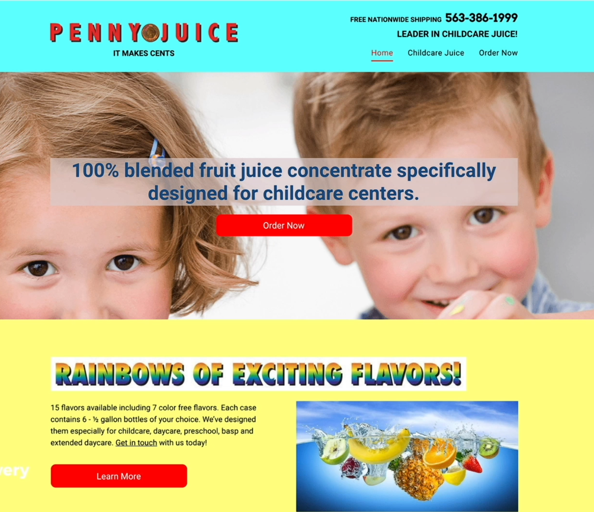
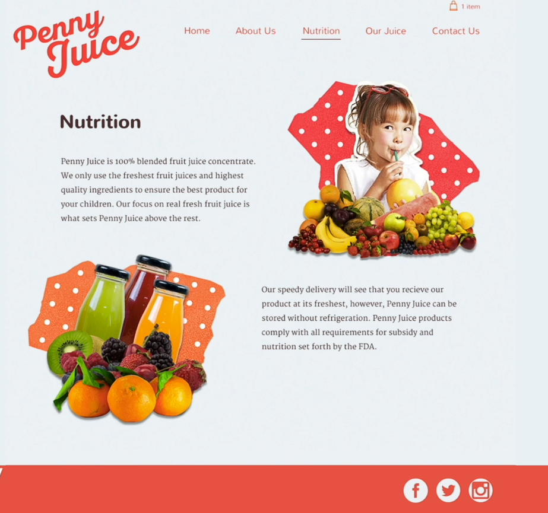

# ✏️ Web Design Study Notes

## 📚 Table of Contents

- [🎨 Introduction to Web Design](#intro)
- [🌈 Color Theory](#color-theory)
- [✍️ Typography](#typography)
- [🖼️ User Interface (UI) Design](#ui-design)
- [🧭 User Experience (UX) Design](#ux-design)

---

## <a name="intro"></a>🎨 Introduction to Web Design

> **💡 Key Concept:** Web design isn't just about aesthetics—it's a value multiplier that directly impacts how users perceive your product and brand.

### ⏱️ The Three-Second Rule

Users make instant judgments about websites, just like in job interviews or first dates.

- **First Impression Window:** ~3 seconds to establish credibility
- **The Goal:** Move beyond "no bugs" to "it's beautiful and it just works"
- **User Mindset:** People judge books by their covers online, whether we like it or not

### 💰 Design as a Value Multiplier

Good design can dramatically increase perceived value without changing the product itself.

#### The Penny Juice Case Study

**Original Website:**



- Chaotic colors, clashing typefaces, inconsistent fonts
- **Result:** Users felt the product was worth ~$1.00

**Redesigned Website:**



- Professional layout, consistent color scheme, intentional typography
- **Result:** Users felt the product was worth ~$3.00

| Version | Design Quality | Perceived Value | Improvement |
| :--- | :--- | :--- | :--- |
| **Original** | Chaotic colors, clashing fonts, inconsistent layout | ~$1.00 | Baseline |
| **Redesigned** | Professional layout, consistent palette, intentional typography | ~$3.00 | **3x increase** |

**Takeaway:** Design is one of the most cost-effective ways to elevate a brand's perceived value—providing a **3x improvement** without changing the product itself.

### 🏛️ The Four Pillars of Web Design

Master these four areas to create beautiful and functional websites:

| Pillar | Focus Area |
| :--- | :--- |
| **Color Theory** | Choosing palettes that harmonize and evoke the right emotions |
| **Typography** | Selecting and pairing fonts to ensure readability and style |
| **User Interface (UI)** | The visual layout and interactive elements (buttons, menus, etc.) |
| **User Experience (UX)** | The overall "feel" and logic of how users navigate the site |

> **Remember:** "Nobody ever says, 'I found this great website; it had no bugs.' They say, 'It looked beautiful and worked exactly like I wanted it to.'"

---

## <a name="color-theory"></a>🌈 Color Theory

> **💡 Key Concept:** Color theory uses psychology and science to create palettes that communicate your brand's message effectively. The wrong color can confuse your audience; the right color reinforces your intent.

### 🧠 Color Psychology (The "Mood" of Color)

Every color carries a subconscious message that influences user perception.

| Color | Emotional Associations | Common Industry Examples |
| :--- | :--- | :--- |
| **Red** | Love, energy, intensity, urgency | Automotive, fast food |
| **Yellow** | Joy, intellect, attention-grabbing | Advertising headlines, logos |
| **Green** | Freshness, growth, safety, health | Grocery brands (HelloFresh, Amazon) |
| **Blue** | Stability, trust, serenity, professionalism | Finance, tech (PayPal, Coinbase) |
| **Purple** | Royalty, wealth, femininity | Luxury brands, niche financial services |

**⚠️ Warning on Yellow:** While excellent for grabbing attention, yellow can be physically painful to look at for extended periods. Avoid using it as a background for long-form content.

### 🎨 Combining Colors Scientifically

Most designs require 2-3 colors. Use the color wheel to create harmonious relationships.

#### 1️⃣ Analogous Palette

**Definition:** Colors located right next to each other on the color wheel.

**Effect:** Creates a harmonious, serene, and consistent look.

**Best For:** Navigation bars, website bodies, logo-background pairings.

**Example:** Blue → Blue-Green → Green

#### 2️⃣ Complementary (Clashing) Palette

**Definition:** Colors located directly opposite each other on the color wheel.

**Effect:** Makes elements "pop" with high contrast.

**Best For:** Logos, icons, highlighting specific products.

**Example:** Red ↔ Green, Blue ↔ Orange

**⚠️ Critical Warning:** Never use complementary colors for text and backgrounds—it creates a "vibrating" effect that's difficult to read.

#### 3️⃣ Multi-Color Systems

| System | Description | Best Use |
| :--- | :--- | :--- |
| **Triadic** | Three colors spaced equally (equilateral triangle) | Balanced, vibrant designs |
| **Square** | Four colors spaced equally around the wheel | Complex, energetic layouts |

### 🛠️ Practical Color Tools

You don't need to be a color scientist—use these professional resources:

- **[Adobe Color](https://color.adobe.com/create/color-wheel):** Manual tool where you select a rule (Triadic, Complementary, etc.) and find perfect Hex codes
- **[Color Hunt](https://colorhunt.co/):** Curated collection of pre-made palettes by professional designers—great for finding trending color schemes quickly

---

## <a name="typography"></a>✍️ Typography

> **💡 Key Concept:** Typography is the art of selecting and arranging type to make written language legible, readable, and appealing. The wrong font can change a message from "romantic" to "threatening."

### 📖 The Two Main Font Families

Understanding font origins helps you use them correctly.

#### Serif Fonts (The "Feet")

**Characteristics:** Small "feet" or decorative strokes at the ends of letter stems.

**Origin:** Inspired by ancient stone carvings where 90-degree angles were impossible to chisel.

**Mood:** Traditional, authoritative, stable, respectable.

| Sub-family | Characteristics | Visual Feel |
| :--- | :--- | :--- |
| **Old Style** | Minimal contrast between thick/thin lines | Classic, aged |
| **Transitional** | Moderate contrast | Balanced, versatile |
| **Modern** | High contrast (e.g., Didot used by Vogue) | Elegant, dramatic |
| **Slab-Serif** | Thick, block-like feet | Bold, impactful |

#### Sans-Serif Fonts (The "No Feet")

**Characteristics:** Clean, straight ends with perfect right angles.

**Mood:** Contemporary, sensible, approachable, simple.

| Sub-family | Characteristics | Examples |
| :--- | :--- | :--- |
| **Humanist** | Highly legible and "friendly" | Gill Sans, Tahoma, Verdana |
| **Grotesque** | More rigid and industrial | Helvetica, Arial |

### 👁️ Legibility vs. Readability

Choosing the right font isn't just about style—it can be a matter of efficiency or even safety.

#### The MIT Study

Researchers found that using Humanist fonts on car dashboards allowed drivers to process information **30-40% faster** than Grotesque fonts, giving them more time to focus on the road.

#### What Makes a Font Legible?

✅ **Open Shapes:** Clear gaps in letters like 'c' or 'e'  
✅ **Ample Spacing:** Letters shouldn't touch  
✅ **Unambiguous Forms:** A 'g' shouldn't look like a '9'; an 'O' should look different from a '0'

### 🎯 Professional Pairing Rules

Keep your website looking "designed" rather than "cluttered" with these guidelines:

| Rule | Description |
| :--- | :--- |
| **Rule of Two** | Stick to maximum of two different fonts per design |
| **Contrast "Serif-ness"** | Pair Serif headings with Sans-Serif body text (or vice-versa) |
| **Vary Weights** | Use Bold/Black for headings, Light/Regular for body |
| **Match Mood & Era** | Ensure fonts feel like they belong to the same "time period" |

#### Example Pairing

```css
h1 {
  font-family: 'Playfair Display', serif;  /* Elegant serif heading */
  font-weight: 700;
}

body {
  font-family: 'Open Sans', sans-serif;    /* Clean sans-serif body */
  font-weight: 400;
}
```

### 🚫 The "Hall of Shame"

Unless you're running a lemonade stand or comic book shop, avoid these fonts:

- ❌ Comic Sans
- ❌ Papyrus
- ❌ Curlz MT
- ❌ Other overly decorative/gimmicky fonts

**Why?** They are difficult to read and lack professional weight.

---

## <a name="ui-design"></a>🖼️ User Interface (UI) Design

> **💡 Key Concept:** UI design is about creating a visual path for the user using psychological cues. It's not just aesthetics—it's about making a website intuitive and professional.

### 📊 Visual Hierarchy

Hierarchy tells users what is most important without making them read every word.

#### Weight & Size

The human brain naturally looks at the biggest, boldest elements first.

**Example:** Coinbase uses massive text for their value proposition and a large input box for emails to capture user data immediately.

#### Color Contrast

Bright "accent" colors draw the eye, while muted grays recede into the background.

**Example:** ASOS uses a gray/white palette but highlights the "Add to Bag" button in bright green to drive sales.

### 📏 Layout and Readability

How you structure text and images determines whether users stay or get overwhelmed.

#### Optimal Line Length

**Avoid:** The "Wikipedia Trap" (lines that are too long)

| Line Length | Effect |
| :--- | :--- |
| **Too Long** | Eye gets tired tracking back to start of next line |
| **40-60 characters** | ✅ **Sweet Spot** — comfortable reading rhythm |
| **Too Short** | Reading rhythm becomes "choppy" and awkward |

#### Chunking Content

Break up large walls of text with images and varying font sizes (like Grammarly) to make information digestible.

### 📐 Alignment: The "Grid" Secret

Alignment is the easiest way to make a design look "designed" rather than "sloppy."

#### The "Line" Rule

Draw imaginary vertical lines through your design. The fewer "starting points" you have, the more professional it looks.

**Pro Tip:** Use a grid system to snap elements to the same starting points.

**Avoid:** Mixing alignments (e.g., center-aligned title with left-aligned body text)

### ⬜ White Space (Negative Space)

White space is the empty room around your elements—a powerful tool for defining luxury.

| Approach | Effect | Example |
| :--- | :--- | :--- |
| **Generous White Space** | High-end, expensive, elevated | Apple ads, designer boutiques |
| **Cramped Spacing** | Cheap, discount, clearance | Overcrowded sale flyers |

**The Luxury Effect:** High-end shops display very few items in large windows, making each item feel expensive.

### 🎯 Designing for Your Audience

Design rules are flexible based on your target users.

**Context Matters:**

- **Children's Concert Poster:** Colorful and "messy" to look fun
- **Crypto Investor Platform:** Clean and "trustworthy" to build confidence

**Style Flexibility:** Shift your approach for teenagers (bold/playful) vs. professionals (clean/minimal)

### ✅ UI Design Checklist

| Principle | Question to Ask |
| :--- | :--- |
| **Hierarchy** | Does the most important button/text stand out? |
| **Layout** | Are my lines between 40-60 characters? |
| **Alignment** | Do elements share a consistent starting line? |
| **White Space** | Is there enough "breathing room" to look expensive? |
| **Audience** | Does the visual style match target user expectations? |

---

## <a name="ux-design"></a>🧭 User Experience (UX) Design

> **💡 Key Concept:** While UI focuses on how a website looks, UX focuses on how it feels and how easily users can achieve their goals. Good UX should be invisible.

### 🌱 The "Architect's Lawn" Philosophy

Good UX is unobtrusive and effortless—it should feel natural.

#### The Story of Reed College

An architect left the campus as a plain lawn for a year. After students walked across it, natural "desire paths" wore down the grass. The architect then paved those specific paths.

**The Lesson:** Observe how users naturally behave and build your design around those habits, rather than forcing them to follow a difficult route.

### 🔑 Core Principles of Good UX

#### 1️⃣ Simplicity

**The Problem:** Cluttered websites with too many links overwhelm the brain.

**The Solution:** Pare content down. Use a mix of images, video, and text with consistent spacing.

| Bad Example | Good Example |
| :--- | :--- |
| Sina (overwhelming links) | Monocle (balanced content) |

#### 2️⃣ Consistency

**Functionality:** Buttons, search bars, and navigation should stay in the same place across all pages.

**Predictability:** If a navigation bar changes design or layout, users have to "re-learn" the site, leading to frustration.

**Impact:** Especially frustrating for older audiences.

#### 3️⃣ Reading Patterns

Our eyes follow predictable paths when scanning a screen. Designers use these to place important information where it will be seen.

| Pattern | Description | Best For |
| :--- | :--- | :--- |
| **F-Pattern** | Eye starts top-left, moves right, then scans down left side | Text-heavy sites, articles, blogs |
| **Z-Pattern** | Eye zig-zags: top-left → top-right → bottom-left → bottom-right | Landing pages with less text, visual CTAs |

#### 4️⃣ All-Platform Design

**Mobile Responsiveness:** Sites must rearrange layout for portrait screens.

**Avoid:**

- ❌ **Cramming:** Desktop sites squeezed into phones result in tiny, unclickable links
- ❌ **Scaling Issues:** Don't just blow up mobile designs to fit desktop—it wastes screen real estate

### 😈 Dark Patterns: The "Evil" Side of Design

A Dark Pattern is a design choice that tricks users into doing something they didn't intend, usually for the company's benefit.

| Dark Pattern | Example | Why It's Bad |
| :--- | :--- | :--- |
| **Visual Deception** | Fake "hair" line on Snapchat ad | Tricks you into clicking while trying to brush it away |
| **Misleading Hierarchy** | Highlighting paid "Express" button, hiding "Free" option | Uses color theory to steal money from users |
| **Hidden Options** | Hiding "No Insurance" in random dropdown (Ryanair) | Makes it difficult to opt-out of extra costs |
| **Trick Wording** | Confusing double-negatives in checkboxes | Leaves users unsure if they're signing up for spam |

**⚠️ Warning:** While Dark Patterns might boost short-term profit, they destroy long-term trust. A tricked user is a user who never comes back.

### 🧪 The Importance of Testing

You cannot know if your UX is good until you see someone else use it.

| Testing Method | Description |
| :--- | :--- |
| **Professional Testers** | If budget allows, hire UX experts |
| **The "Cookie" Method** | Give your site to friends/family and watch where they get stuck |

**Pro Tip:** Use feedback to refine the "paths" of your website, just like the architect's lawn.

---

## 🔗 Useful Resources

- **Color Tools:**
  - [Adobe Color Wheel](https://color.adobe.com/create/color-wheel) — Manual color palette generator
  - [Color Hunt](https://colorhunt.co/) — Curated color palettes
  
- **Typography:**
  - [Google Fonts](https://fonts.google.com/) — Free, professional web fonts
  - [Font Pair](https://fontpair.co/) — Font pairing suggestions

- **UI/UX:**
  - [Laws of UX](https://lawsofux.com/) — Psychological principles for design
  - [UI Patterns](https://ui-patterns.com/) — Common design patterns

---

## 🧾 Summary

Web design is the intersection of art and psychology. Master the four pillars—Color Theory, Typography, UI, and UX—to create websites that are not only beautiful but also effective.

**Golden Rule:** "Nobody ever says, 'I found this great website; it had no bugs.' They say, 'It looked beautiful and worked exactly like I wanted it to.'"

**The Value Proposition:** Good design can provide a **3x improvement** in perceived value—making it one of the most cost-effective investments for any brand.

---
